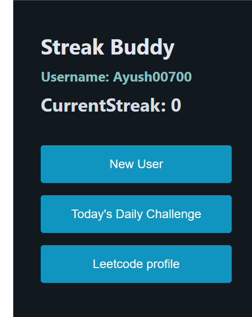

# CurrentStreak Counter Extension

## Introduction
The Streak Counter Extension is designed for users who wish to track their daily activity streaks on platforms like LeetCode. By simply entering a username, users can quickly view their current streak, encouraging consistent daily practice.

## Function

- User Input : Accepts username to retrieve continuous data.
- Show continuity : Shows current continuity in a user-friendly interface.
- Cross-platform compatibility : Works on multiple browsers, including Chrome and Firefox.

## Build Instructions
1. Prerequisites : Make sure you have Node.js (version 14.xx or higher) and npm (version 6.xx or higher) installed. 
2. If you need to work with server clone this repository:  `https://github.com/Abhiojiki/serverForRequest.git`(Optional)
3. Clone the repository: `git clone https://github.com/yourusername/streakCounterExtension.git`
4. Navigate to the project directory: `cd streakCounterExtension`
5. Install dependencies: `npm install`
5. Build the extension: `npm run build`

## Screenshots

## Build Environment Requirements
- OS: Windows 10, macOS, Linux
- Node.js  Version 14.xx or higher. 
- npm  version 6.xx or higher. 

##More details
- The extension requires internet access to fetch continuous data from the platform's API.
- Make sure your CORS settings are properly configured to allow API requests from your server to  your extension.  
- For development purposes, you can use synthetic data to simulate API responses.
- web-ext-artifacts folder contains zip folder of this project.

## Dependencies
- axios : Used to make HTTP requests to fetch continuous data.
- webpack : Used to bundle JavaScript files for use in the browser.
- babel : Used to compile ES6 JavaScript to ES5 for wider browser compatibility.

## Important Notes
This extension uses a proxy server already hosted on the Internet, so you don't need to build a separate server.  This proxy server responds to your requests.  Depending on your hosting service provider's policies, the first GET request may typically take some time to respond, but after that it will work normally.
